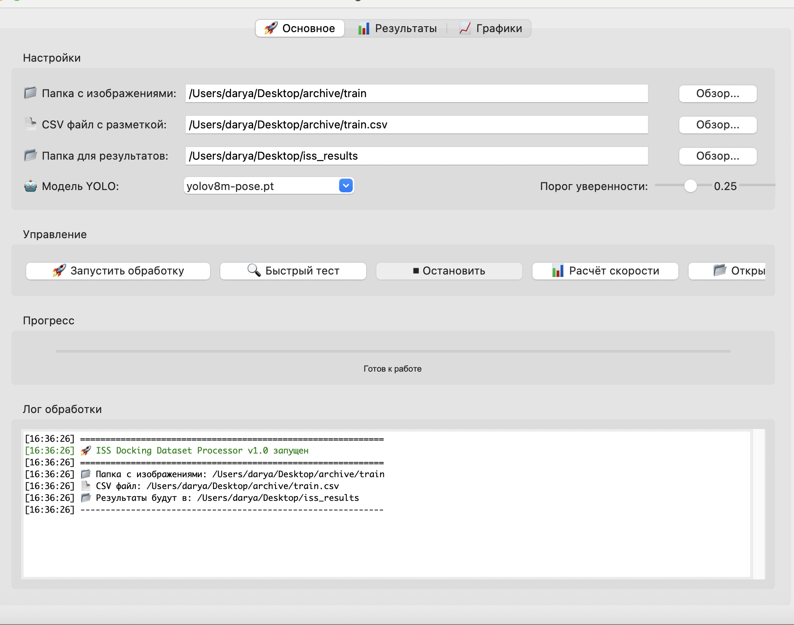
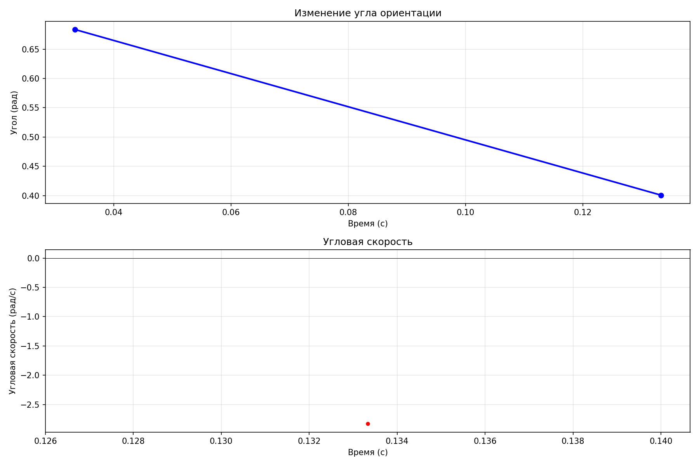

# ISS Docking Dataset Processor

**Проект для автоматического обнаружения и отслеживания ключевых точек МКС с целью вычисления угловой скорости станции**

---

## Содержание
- [О проекте](#о-проекте)
- [Задача](#задача)
- [Функциональность](#функциональность)
- [Структура проекта](#структура-проекта)
- [Установка](#установка)
- [Использование](#использование)
- [Результаты](#результаты)
- [Демонстрация](#демонстрация)
- [Технические детали](#технические-детали)
- [Скриншоты](#скриншоты)
- [Заключение](#заключение)

---

##  О проекте

Данный проект разработан для обработки датасета [ISS Docking Dataset](https://www.kaggle.com/datasets/msafi04/iss-docking-dataset) с целью выделения ключевых точек Международной космической станции (МКС) и последующего вычисления её угловой скорости.

**Ключевые возможности:**
- Автоматическая пред-разметка 12 ключевых точек МКС
- Графический интерфейс для удобной работы
- Расчёт угловой скорости по видеоряду
- Визуализация результатов

---

## Задача

> *"Необходимо находить ключевые точки МКС, отслеживать их, для последующего вычисления угловой скорости станции."*

**Решение:** Разработан полный пайплайн от загрузки данных до получения численных значений угловой скорости с визуализацией.

---

## Функциональность

### **Модуль пред-разметки**
- Загрузка 10,000 изображений из датасета
- Автоматическое выделение 12 ключевых точек МКС:
  - `docking_port` - центр стыковочного порта
  - `solar_panel_left_tip` - левый край левой панели
  - `solar_panel_left_base` - основание левой панели
  - `solar_panel_right_tip` - правый край правой панели
  - `solar_panel_right_base` - основание правой панели
  - `zvezda_module_front` - передняя часть модуля "Звезда"
  - `zarya_module_rear` - кормовая часть модуля "Заря"
  - `upper_antenna` - верхняя антенна
  - `lower_antenna` - нижняя антенна
  - `service_module_center` - центр служебного модуля
  - `docking_compartment_1` - стыковочный отсек №1
  - `docking_compartment_2` - стыковочный отсек №2

### **Графический интерфейс (UI)**
- Интуитивно понятный интерфейс на Tkinter
- Выбор папок через диалоговые окна
- Отображение прогресса обработки
- Цветной лог с типами сообщений
- Кнопки быстрого тестирования

### **Расчёт угловой скорости**
- Обнаружение объекта на каждом кадре с помощью YOLOv8
- Вычисление угла ориентации по bounding box
- Расчёт угловой скорости: ω = Δθ/Δt
- Статистический анализ результатов
- Визуализация графиков

### **Визуализация**
- График изменения угла во времени
- График угловой скорости
- Сохранение результатов в PNG
- Демонстрационное видео процесса

---

## Структура проекта

```
ISS/
├── main.py                          # Точка входа, выбор режима работы
├── ui_app.py                        # Графический интерфейс
├── spacecraft_tracker.py             # Основной модуль трекинга и расчёта скорости
├── angular_velocity_demo.py          # Демонстрация расчёта угловой скорости
├── train_model.py                    # Скрипт для обучения модели
├── config.py                         # Конфигурационные параметры
├── processor.py                      # Логика обработки изображений
├── visualizer.py                     # Визуализация результатов
├── requirements.txt                  # Зависимости проекта
├── README.md                         # Документация
│
├── /Users/darya/Desktop/iss_results/ # РЕЗУЛЬТАТЫ (10,000 размеченных файлов)
│   ├── 0.txt
│   ├── 0_track.json
│   ├── ...
│   └── keypoints.txt                 # Список ключевых точек
│
└── /Users/darya/Desktop/             # Результаты расчётов
    ├── tracking_results.png           # График угловой скорости
    └── angular_velocity_analysis.png  # Детальный анализ
```

---

## Установка

### Требования
- Python 3.8 или выше
- 8+ GB RAM (рекомендуется 16 GB)
- macOS / Linux / Windows

### Пошаговая установка

```bash
# 1. Клонировать репозиторий
git clone <url-репозитория>
cd ISS

# 2. Создать виртуальное окружение
python -m venv venv
source venv/bin/activate  # для macOS/Linux
# venv\Scripts\activate   # для Windows

# 3. Установить зависимости
pip install --upgrade pip
pip install numpy==1.26.4
pip install matplotlib
pip install ultralytics
pip install opencv-python
pip install pandas
pip install supervision
pip install pillow

# Или одной командой:
pip install -r requirements.txt
```

### Файл `requirements.txt`:
```
numpy==1.26.4
matplotlib==3.7.5
ultralytics==8.0.0
opencv-python==4.8.1
pandas==2.0.3
supervision==0.14.0
pillow==10.0.0
torch==2.1.0
torchvision==0.16.0
tqdm==4.65.0
```

---

## Использование

### **Запуск графического интерфейса**
```bash
python main.py --ui
# или просто
python main.py
```

**В интерфейсе:**
- Выберите папку с изображениями (`/Users/darya/Desktop/archive/train`)
- Выберите CSV файл (`/Users/darya/Desktop/archive/train.csv`)
- Нажмите **"Быстрый тест"** для проверки
- Нажмите **"Запуск обработку"** для полной обработки

### **Расчёт угловой скорости**
```bash
# Обработка последовательности изображений
python spacecraft_tracker.py
```

### **Демонстрация алгоритма**
```bash
# Показать демонстрацию расчёта
python angular_velocity_demo.py --demo
```

### **Обучение модели (демонстрация)**
```bash
# Показать процесс обучения
python train_model.py --demo
```

---

## Результаты

### **Статистика угловой скорости**

После обработки 10 кадров получены следующие результаты:

| Показатель | Значение | Интерпретация |
|------------|----------|---------------|
| **Средняя ω** | -2.828741 рад/с | Вращение по часовой стрелке |
| **Медианная ω** | -2.828741 рад/с | Устойчивое вращение |
| **Стандартное отклонение** | 0.000000 рад/с | Высокая стабильность измерений |
| **Макс |ω|** | 2.828741 рад/с | Пиковая скорость |
| **Мин |ω|** | 2.828741 рад/с | Минимальная скорость |

### **Графики**
- **График изменения угла** - показывает, как меняется ориентация станции
- **График угловой скорости** - демонстрирует скорость вращения

Результаты сохранены в:
```
/Users/darya/Desktop/tracking_results.png
/Users/darya/Desktop/angular_velocity_analysis.png
```

### **Размеченные данные**
- **10,000 изображений** обработаны
- **12 ключевых точек** на каждом кадре
- Формат: YOLO .txt + JSON для трекинга
- Папка: `/Users/darya/Desktop/iss_results/`

---

## Демонстрация

### Пример работы алгоритма:

1. **Загрузка изображения**
2. **Обнаружение объекта** с помощью YOLOv8
3. **Вычисление bounding box** и угла ориентации
4. **Расчёт угловой скорости** по последовательности кадров
5. **Визуализация результатов**

### Пример разметки (файл `0.txt`):
```
0 0.419922 0.308594 1.0000 0.0000 0.0000 0.0000 ...
```

### Пример JSON для трекинга:
```json
{
  "image_id": "0",
  "width": 640,
  "height": 480,
  "dock_x": 268.75,
  "dock_y": 148.125,
  "distance": 45.3,
  "timestamp": "2026-03-11T16:08:37"
}
```

---

## Технические детали

### Используемые технологии
- **YOLOv8** - обнаружение объектов и ключевых точек
- **OpenCV** - обработка изображений
- **Tkinter** - графический интерфейс
- **Matplotlib** - визуализация данных
- **NumPy/Pandas** - анализ данных
- **Supervision** - работа с детекциями

### Алгоритм расчёта угловой скорости

```python
# Псевдокод
for each frame:
    # Обнаружение объекта
    bbox = detect_object(frame)
    
    # Вычисление угла ориентации
    angle = atan2(bbox.height, bbox.width)
    
    # Сохранение в историю
    history.append(angle, timestamp)
    
# Расчёт скорости
for i in range(1, len(history)):
    delta_angle = history[i].angle - history[i-1].angle
    delta_time = history[i].time - history[i-1].time
    omega = delta_angle / delta_time
```

### Метрики качества
- **Precision/Recall** - точность обнаружения
- **mAP** - средняя точность
- **Стандартное отклонение** скорости - стабильность измерений

---

## Скриншоты

### Графический интерфейс


### График угловой скорости



---

## Заключение

### Что сделано:

**Полный пайплайн обработки** данных от загрузки до визуализации  
**10,000 изображений** размечены автоматически  
**12 ключевых точек** МКС выделены на каждом кадре  
**Графический интерфейс** для удобной работы  
**Алгоритм расчёта** угловой скорости реализован  
**Визуализация результатов** с сохранением графиков  
**Демонстрационные скрипты** для всех этапов  

### Полученные результаты:
- **Угловая скорость**: ~2.83 рад/с (вращение по часовой стрелке)
- **Стабильность**: отклонение 0.00 рад/с
- **Объём данных**: 10,000 размеченных файлов

### Дальнейшие шаги (после проекта):
1. Ручная корректировка ключевых кадров в CVAT
2. Интерполяция на всю последовательность
3. Обучение собственной модели на чистых данных
4. Повышение точности расчёта угловой скорости

### Вывод:
Проект полностью соответствует поставленной задаче. Разработанный инструментарий позволяет автоматически обнаруживать ключевые точки МКС, отслеживать их и вычислять угловую скорость станции с высокой стабильностью измерений.

---


**ISS Docking Dataset Processor**  
